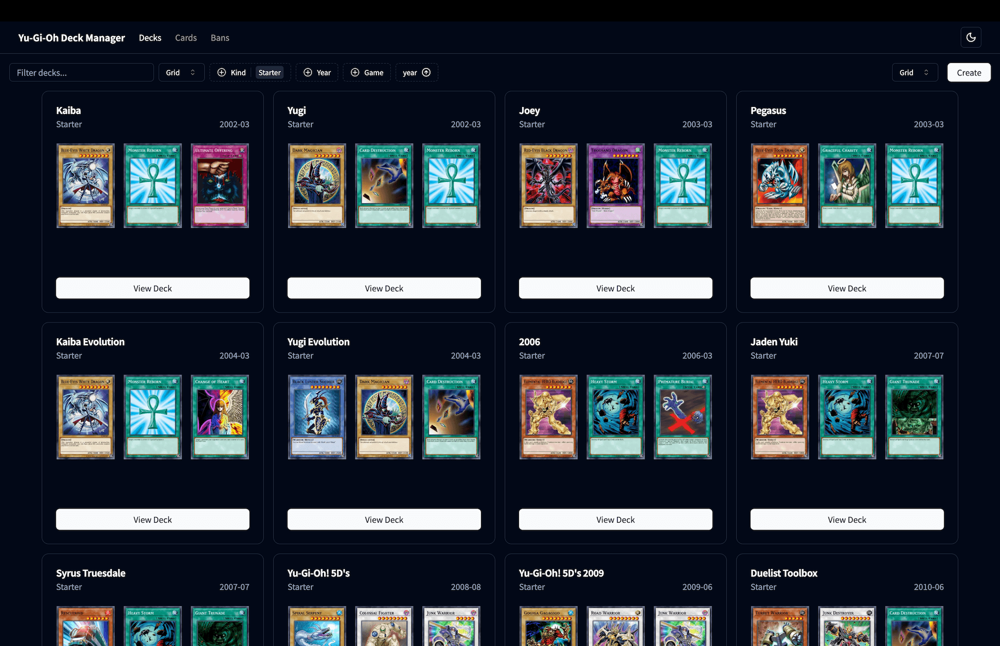
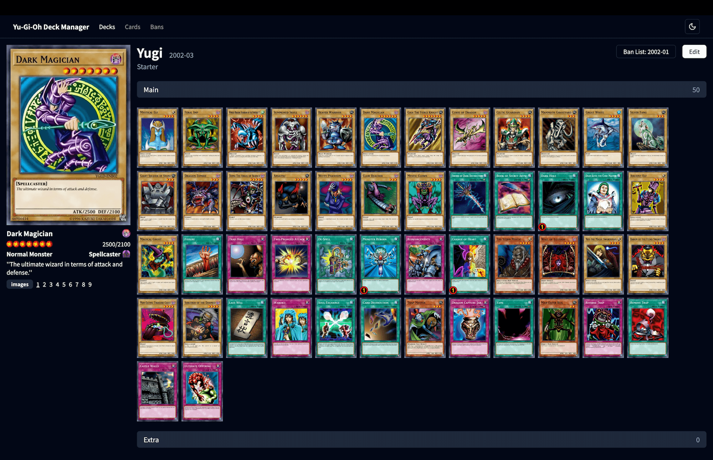
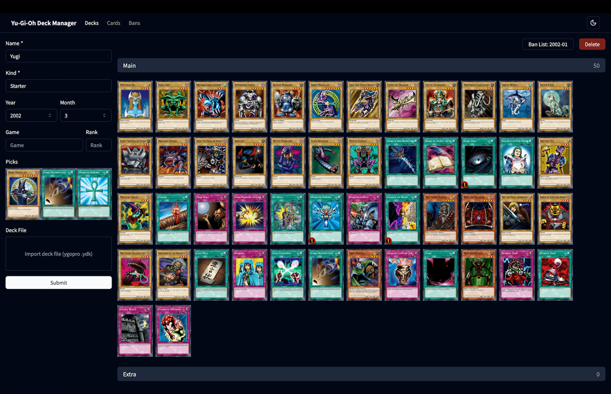
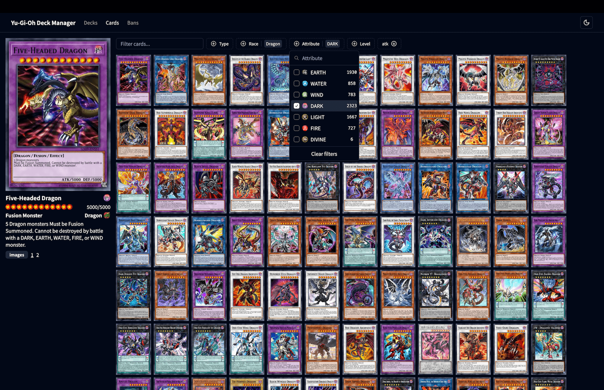
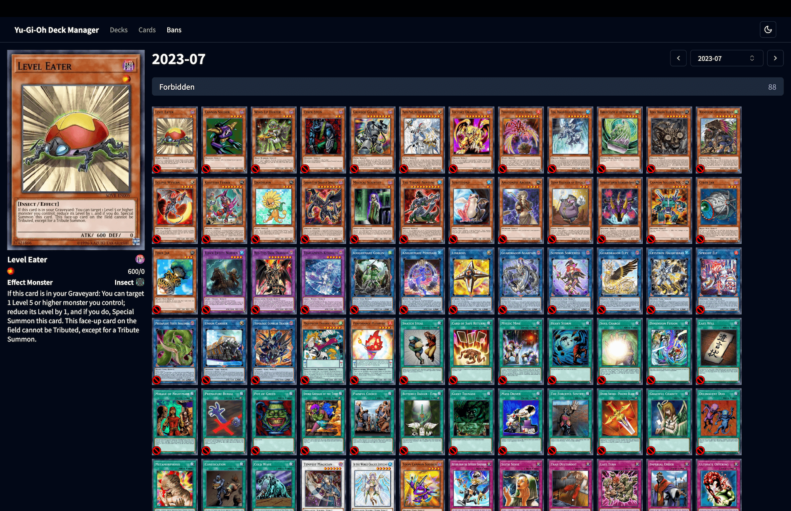

# 유희왕 덱 매니저

당신의 유희왕 덱을 로컬 환경에서 관리하세요.

## 기능

- 덱 리스트를 파일로 관리
- `.ydk` 파일 불러오기
- 덱 메타데이터 수정
- 덱 리스트 필터링/정렬
- 카드 리스트 필터링/정렬
- 금제 리스트 조회

## 사용 방법

### 데이터 설정

#### 데이터 레이아웃

```
├── data               # All data goes here (ignored by git)
│   ├── decks          # contains deck files
│   │   ├── **/*.json  # deck file
│   ├── cards.json     # cards data file
│   ├── bans.json      # bans data file
├── public             # Next.js static serving directory
│   ├── images         # contains card images
│   │   ├── *.jpg      # card image file
├── langs              # contains language specific files
│   ├── attribute.json # attribute translations file
│   ├── race.json      # race translations file
└── assets             # contains static assets (mostly icons)
```

#### 카드 데이터 받아오기

```sh
node scripts/download_cards.js data/
```

[YGOPRODECK API](https://ygoprodeck.com/api-guide/)를 호출한 결과를 `data/cards.json` 파일로 저장합니다.

해당 파일을 기준으로 덱의 카드 ID를 조회합니다.

#### 카드 이미지 받아오기

**Option 1 - Release 페이지에서 다운로드**

[Release](https://github.com/niceandneat/yugioh-deck-manager/releases/tag/v0.1.0) 페이지에서 `images.zip` 파일을 다운로드 받고 `public/` 폴더에 압축을 풉니다.

**Option 2 - 스크립트 파일로 직접 다운로드**

```sh
node scripts/download_images.js data/cards.json public/images/
```

`data/cards.json` 파일의 이미지 url을 조회하면서 카드 이미지들을 `public/images/` 폴더에 저장합니다.

이미지 파일의 이름은 `{cardId}.jpg` 규칙을 따릅니다. 위에서

#### 금제 데이터 받아오기

```sh
node scripts/download_bans.js data/
```

[YGOPRODECK API](https://ygoprodeck.com/api-guide/)를 호출한 결과를 `data/bans.json` 파일로 저장합니다.

해당 파일을 기준으로 금제 리스트를 적용합니다.

#### 언어 설정

대부분 `data/cards.json` 파일의 언어와 상관없이 동작하지만, 카드의 `race`/`attribute` 정보의 아이콘을 표기하기 위해 번역 파일이 필요할 수 있습니다.

만약 영어가 아닌 번역된 `data/cards.json` 파일을 사용한다면(제가 그렇습니다), `langs/attribute.json` 파일과 `langs/race.json` 파일에 필요한 번역 값을 추가해야합니다. 해당 파일들을 참고해주세요.

### 실행

준비물: [Node.js](https://nodejs.org/en/download) v16.8+

```sh
# Build
npm run build

# Start Server
npm run start
```

그리고나서, 웹 브라우저로 `http://localhost:3000` 주소에 접속합니다.

## Implementation Details

이 프로젝트는 [Next.js](https://github.com/vercel/next.js)의 [App Router](https://nextjs.org/docs/app/building-your-application/routing)를 사용합니다. 도메인별로 유즈 케이스에 맞춰서 [Server/Client Component](https://github.com/reactjs/rfcs/blob/main/text/0188-server-components.md)와 [Dynamic/Static Rendering](https://nextjs.org/docs/app/building-your-application/rendering/static-and-dynamic)을 다르게 구분해서 사용했습니다.

### Decks (Dynamic/Active)

- **Dynamic**: 데이터가 자주 변합니다.
- **Active**: 필터/정렬 등 상호작용이 자주 일어납니다.

#### Dynamic Rendering

덱 데이터는 생성/수정/삭제가 가능해 서버에서 영구적으로 캐싱할 수 없습니다. 변하는 데이터를 항상 반영하기 위해 필터/정렬 정보를 [URL SearchParams](https://nextjs.org/docs/app/building-your-application/rendering/static-and-dynamic#dynamic-functions)로 처리했습니다. 때문에 덱 리스트 페이지는 [Full Route Cache](https://nextjs.org/docs/app/building-your-application/caching#full-route-cache)가 비활성화 되고, 항상 request time에 dynamic rendering 합니다. 필터/정렬 정보를 searchParams를 통해 server component에서 알 수 있으므로, 필요한 데이터만 client component에 전달할 수 있습니다.

#### Cache Sorted Result

서버에서 덱 리스트 정렬 결과를 캐시해 dynamic rendering 할 때 중복된 정렬 요청을 하지 않도록 했습니다. 파일에 직접 접근해 데이터를 관리하기 때문에 [fetch](https://nextjs.org/docs/app/api-reference/functions/fetch) 함수를 사용할 수 없어 간단한 메모리 캐시를 구현했습니다. 덱 생성/수정/삭제가 발생했을 경우 캐시를 revalidate합니다.

### Cards (Static/Active)

- **Static**: 데이터가 변하지 않습니다.
- **Active**: 필터/정렬 등 상호작용이 자주 일어납니다.

#### Static Rendering & Client Component

카드 데이터는 수정 될일이 없는 정적인 데이터이므로 카드 리스트 페이지를 static rendering 시켜서 Full Route Cache에 캐싱되도록 했습니다. 다만 카드 리스트 페이지 안에서는 필터/정렬을 자주 사용하므로, 캐싱된 데이터를 필터/정렬 하는건 client component 내부에서 처리했습니다.

### Bans (Static/Passive)

- **Static**: 데이터가 변하지 않습니다.
- **Passive**: 상호작용이 일어나지 않습니다.

#### Build Time Static Rendering

금제 데이터는 수정될 일이 없는 정적인 데이터이고, 각 페이지에서도 상호작용에 따른 변화가 없기 때문에 [generateStaticParams](https://nextjs.org/docs/app/api-reference/functions/generate-static-params) 함수를 사용해 미리 모든 밴 데이터에 대한 페이지를 빌드 타임에 렌더링했습니다.

## References

- [shadcn/ui](https://ui.shadcn.com/): 컴포넌트들이 정말 멋집니다! 홈페이지의 예제에서도 많은 도움을 받았습니다.
- [yugiohprodeck](https://ygoprodeck.com/api-guide/): 유희왕 덱, 카드 데이터베이스 그 자체
- [yugioh fandom wiki](https://yugioh.fandom.com/): 퀄리티 좋은 아이콘들을 구할 수 있었습니다.

## Screenshots

  
  
  
  

